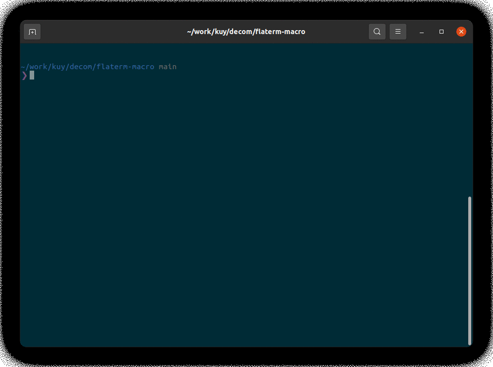

<h1 align="center">macro-harness</h1>
<p align="center">
  <b>Test harness for <a href="https://doc.rust-lang.org/reference/procedural-macros.html">procedural macros</a></b>
</p>

[](https://github.com/kuy/macro-harness/actions/workflows/ci.yml)



## 🚨 UNDERDEVELOPMENT 🚨

Working on MVP :)

## Usage

### 1. Prepare `Cargo.template.toml` file in `tests` directory

You can use a relative path to the local dependency.  
No need to put `[lib]` section.

```toml
[package]
name = "awesome-project-tests"
edition = "2018"
publish = false

[dependencies]
futures = "1"
my-lunatic-dep = { path = "../../my-lunatic-dep" }
```

### 2. Put a pair of source and output files in `tests` directory

`test_nodes.rs`

```rust
use flaterm_macro::layout;

pub fn test() {
    layout! {
        <Block>
            <Text />
        </Block>
    };
}
```

`test_nodes.stdout`

```rust
#![feature(prelude_import)]
#[prelude_import]
use std::prelude::rust_2018::*;
#[macro_use]
extern crate std;
use flaterm_macro::layout;
pub fn test() {
    {
        let mut __flaterm_l = ::flaterm::Node::new(::std::string::String::from("Block"));
        let mut __flaterm_c: ::std::vec::Vec<::flaterm::Node> = ::std::default::Default::default();
        __flaterm_c.push(::std::convert::Into::into({
            let mut __flaterm_l = ::flaterm::Node::new(::std::string::String::from("Text"));
            __flaterm_l
        }));
        __flaterm_l.children = __flaterm_c;
        __flaterm_l
    };
}
```

### 3. Write test file

`test.rs`

```rust
use macro_harness::run;

#[test]
fn test_node() {
    run("tests/test_nodes.rs");
}
```

### 4. Run `cargo test` and get result

Here is a structure of an example project.

```
.
├── Cargo.toml
├── src
│  └── lib.rs
└── tests
   ├── Cargo.template.toml
   ├── test_nodes.rs
   ├── test_nodes.stdout
   └── test.rs
```

### 5. Use `MACRO_HARNESS=overwrite` environment variable to update `.stdout` files

`MACRO_HARNESS=overwrite cargo test`

## Example

See [`tests`](https://github.com/kuy/decom/tree/main/flaterm-macro/tests) in [flaterm-macro](https://github.com/kuy/decom/tree/main/flaterm-macro).

## TODOs

- [ ] Support glob match
- [ ] Stop using `panic!()` on everything
- [ ] Improve printing result
- [ ] CI using GitHub Actions
- [ ] Publish to crates.io
- [ ] Handle various errors
  - [ ] Not installed `cargo-expand` crate
  - [ ] Version mismatch of `cargo-expand` (require `1.0.8` or later)

## License

MIT

## Author

Yuki Kodama / [@kuy](https://twitter.com/kuy)
